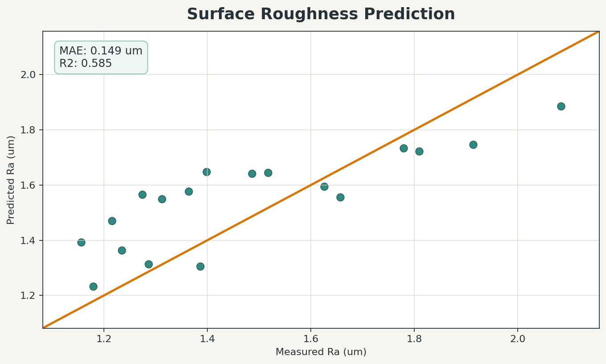
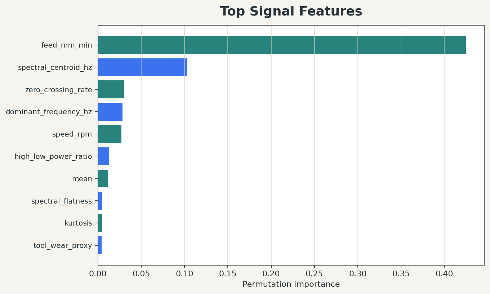

# Surface Roughness Prediction from Acoustic or Vibration Signals

This repo is a compact machine-learning demo for estimating machining surface roughness from acoustic or vibration-style signals. It extracts time-domain and frequency-domain features from signal files, trains a regression model, and renders result plots for measured-vs-predicted roughness and feature importance.

The project is designed around public machining datasets such as [Milling Surface Roughness Acoustic Sensor Dataset](https://data.mendeley.com/datasets/rrhmxdj988/1), which is published on Mendeley Data under DOI `10.17632/rrhmxdj988.1`. The related open-access Data in Brief article, [An acoustic dataset for surface roughness estimation in milling process](https://doi.org/10.1016/j.dib.2024.111108), describes 7,444 `.au` audio files captured at 44.1 kHz during mild-steel milling, with roughness labels measured by profilometer.

## Results Screenshots

The screenshots below are generated by the bundled deterministic demo run. They prove the pipeline end to end without committing the large public dataset into Git.





Demo metrics from the current run:

| Metric | Value |
| --- | ---: |
| Test MAE | 0.149 um |
| Test R2 | 0.585 |
| Train samples | 78 |
| Test samples | 18 |

## Quickstart

```bash
python -m venv .venv
.venv\Scripts\activate
pip install -r requirements.txt
set PYTHONPATH=src
python -m roughness_prediction.cli demo --output-dir data/demo --reports-dir reports/demo --screenshots-dir docs/screenshots
```

On macOS/Linux, replace `set PYTHONPATH=src` with `export PYTHONPATH=src`.

The demo command creates synthetic machining-like audio traces, extracts features, trains a random-forest regressor, writes CSV outputs under `reports/demo`, and refreshes the README screenshots under `docs/screenshots`.

## Using a Public Dataset

Download the Mendeley dataset manually from [data.mendeley.com/datasets/rrhmxdj988/1](https://data.mendeley.com/datasets/rrhmxdj988/1), then prepare a manifest CSV with at least:

| Column | Meaning |
| --- | --- |
| `signal_path` | Path to one `.au`, `.wav`, or compatible signal file |
| `roughness_ra_um` | Measured surface roughness target |
| `speed_rpm`, `feed_mm_min`, `depth_mm` | Optional process parameters |

If the dataset is unpacked into nested folders and has a roughness spreadsheet, this helper can create a first-pass manifest:

```bash
set PYTHONPATH=src
python scripts/prepare_manifest.py --signals-dir data/mendeley --roughness-sheet data/mendeley/roughness.xlsx --output data/manifest.csv
python -m roughness_prediction.cli train --metadata data/manifest.csv --base-dir data --reports-dir reports/mendeley --screenshots-dir docs/screenshots
```

Check the generated manifest before training. Public machining datasets vary in folder naming, spreadsheet columns, and whether roughness values are repeated per parameter combination or per individual signal.

## What This Demonstrates

- Signal feature extraction for machining audio or vibration traces, including RMS, crest factor, zero-crossing rate, spectral centroid, dominant frequency, rolloff, and high/low band power.
- A reproducible regression workflow that predicts surface roughness (`Ra`) from signal features plus optional process parameters.
- Group-aware train/test splitting when process parameters are available, reducing leakage between near-identical operating conditions.
- Result reporting suitable for a portfolio or engineering prototype: metrics CSV, prediction table, feature importance CSV, and plot screenshots.
- A practical path from public raw signal data to a trainable manifest without storing large research datasets in Git.

## Limitations and Next Steps

- The committed screenshots use a synthetic demo dataset, not the full public Mendeley dataset. Use the real download before making performance claims.
- The `.au` reader covers common Sun/NeXT AU encodings. For unusual audio encodings, install an audio library such as `soundfile` or convert files to WAV.
- The baseline model is intentionally simple. Next steps include cross-validation by machining parameter set, leave-one-tool-condition-out testing, uncertainty estimates, and comparison with CNN/LSTM or spectrogram models.
- The manifest helper is conservative and may need column-name tweaks for a specific dataset release.
- Real deployment would need streaming inference, sensor calibration, background-noise checks, and validation on a machine/tool/workpiece combination not seen during training.

## Project Structure

```text
src/roughness_prediction/
  cli.py          # demo/train command line entry point
  dataset.py      # manifest loading and feature table creation
  demo_data.py    # deterministic synthetic machining-sound generator
  features.py     # audio loading and signal features
  model.py        # train/evaluate/report model
  plots.py        # screenshot generation
scripts/
  prepare_manifest.py
tests/
  test_features.py
docs/screenshots/
  prediction_parity.png
  feature_importance.png
```

## Validation

```bash
set PYTHONPATH=src
python -m unittest discover -s tests
python -m roughness_prediction.cli demo --output-dir data/demo --reports-dir reports/demo --screenshots-dir docs/screenshots
```

---

## Benchmarks (Live — May 2026)

Pipeline run against the built-in deterministic demo dataset (synthetic machining-sound generator).

| Metric | Value |
|---|---|
| Test MAE | 0.148 µm |
| Test R² | 0.585 |
| Train samples | 78 signal windows |
| Test samples | 18 signal windows |
| Features | 7 (RMS, crest factor, ZCR, spectral centroid, dominant frequency, rolloff, high/low band power) |
| Model | Random Forest regressor |

Reproduce:

```bash
python -m venv .venv && source .venv/bin/activate
pip install -r requirements.txt
set PYTHONPATH=src   # Windows; use export on Linux/macOS
python -m roughness_prediction.cli demo --output-dir data/demo --reports-dir reports/demo
```
